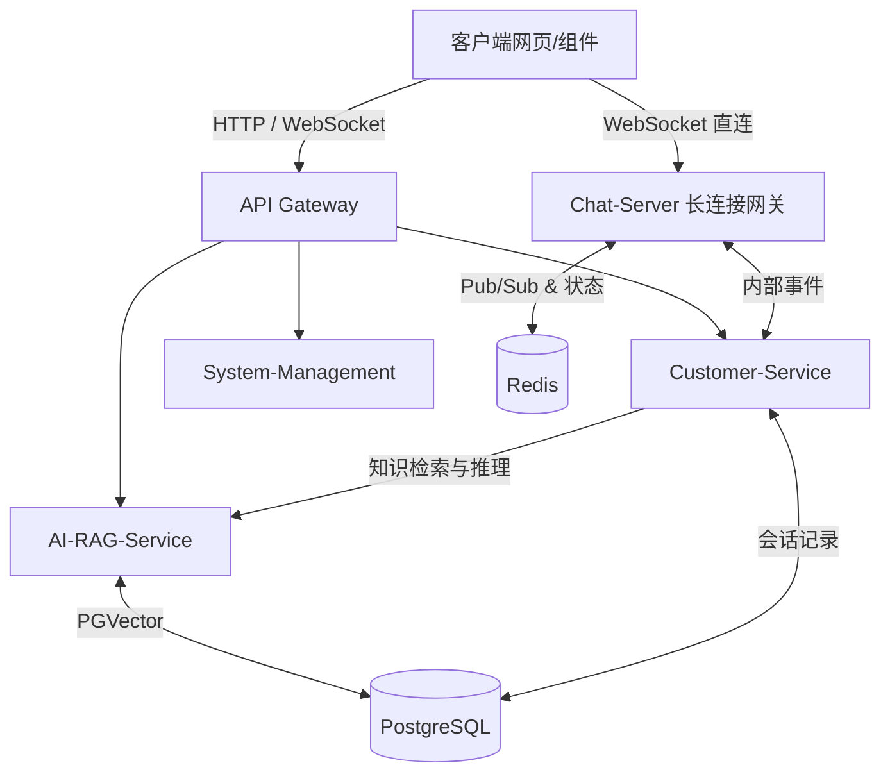

# LinkedAgent 智能客服平台功能文档

## 项目概述
**LinkedAgent** 是一款旨在“连接客户与服务”的新一代智能客服平台。通过将现代前端体验、稳定的 Java 微服务后端与前沿的 AI 大模型深度结合，它能够实现企业客服的智能化提效与无缝人机协作。

### 核心技术栈
- **前端**: React 19, TypeScript, Vite 8, TailwindCSS 4, shadcn/ui
- **后端**: Java 17, Spring Boot 3.2.4, Spring Cloud (Alibaba) 2023
- **数据与 AI**: PostgreSQL + `pgvector` (关系型与向量存储), Redis (高频缓存与会话状态)

### 系统架构图


## 快速开始

### 依赖环境
- Node.js (>= 18)
- Java 17, Maven 3.8+
- PostgreSQL (需安装 `pgvector` 扩展插件)
- Redis

### 启动项目
为免除常规批处理因防毒安全保护误锁杀或报错打碎多终端执行体，本项目全面以“智能主代理托管多路执行器”作为新时序一键部署入口：
- **指导手册**：只需把需求语（如“启动此系统”、“加载打通全线”）讲给 Agent（AI助手），由它自动认读 **项目根深根目录下 [ONE_CLICK_START.md](../ONE_CLICK_START.md)** 全新指引文档，毫不出声且极速并发常驻式为您直搭运行整套体系大线。
- 启动全效开启确认完成瞬际，请直达访问页面：[http://localhost:5173](http://localhost:5173) *(网关穿棒服务互连已完全生效。如需指定 `--server.address=127.0.0.1` 以免疫微信及通讯工具强固闭套通信口锁占用，指引均已内置其心！)*

## API 参考

### AI 智能问答模块 (`AI-RAG-Service`)

#### 1. 提交对话问题
- **接口**: `POST /api/ai/ask`
- **功能**: 向系统发起提问，触发检索知识库（RAG）并请求大模型生成答案。
- **请求体 (JSON)**: 
  ```json
  {
    "query": "关于退货的政策是什么？",
    "sessionId": "visitor-12345"
  }
  ```
- **返回体 (JSON)**: 
  ```json
  {
    "success": true,
    "answer": "根据知识库内容，您的退货政策为..."
  }
  ```

#### 2. 上传知识库文档
- **接口**: `POST /api/ai/doc/upload`
- **格式**: `multipart/form-data`, 表单字段名为 `file`
- **功能**: 自动对上传文档进行切分（Chunking，每 500 字符切分，预留 100 字符重叠度）、调用 Embedding 服务计算向量，并持久化到 PostgreSQL 的向量库中。

#### 3. 获取已上传知识库列表
- **接口**: `GET /api/ai/doc/list`
- **功能**: 返回所有处理完毕的文档名称及切片统计信息。

#### 4. 删除文档
- **接口**: `DELETE /api/ai/doc`
- **参数**: Query `?name=文档名称`
- **功能**: 从系统中彻底删除某份文档及其相关的向量数据。

### 客户服务模块 (`Customer-Service`)

#### 1. 获取客服历史聊天记录
- **接口**: `GET /api/agent/chat/history/{visitorId}`
- **功能**: 获取指定访客过往与 AI 及人工的完整对话上下文记录，用于人工客服的无缝接管与状态漫游。

## 使用示例

### 前端调用 AI 问答接口
在前端应用（如 `VisitorClient.tsx` 中），通常会封装对 AI 问答的调用：

```javascript
import axios from 'axios';

async function askQuestion(questionText) {
    try {
        const response = await axios.post('/api/ai/ask', {
            query: questionText,
            // 生成临时匿名访客 Session
            sessionId: "session-" + Math.random().toString(36).substring(7)
        });
        
        if (response.data.success) {
            console.log("AI 回复内容:", response.data.answer);
        }
    } catch (error) {
        console.error("对话请求失败:", error);
    }
}
```

## 常见问题 (FAQ)

**1. 为什么知识库上传成功了，但 AI 回答质量不高或经常遗漏关键信息？**
**答**：可能是切片策略（Chunking）导致的上下文截断。系统当前采用的是固定的文本分片策略（500 字符大小，100 字符重叠），如果您上传的是高度结构化的文档（如 Markdown、复杂表格），建议在 `DocumentParserService` 中引入针对特定结构的语义切片逻辑。

**2. 如果需要对接内部私有化的大模型，需要改动多少代码？**
**答**：因为系统在 `AI-RAG-Service` 中做了防腐层设计，您只需要替换服务层中调用外部大模型 API 的具体客户端实现，无需修改外围的 `Controller` 层以及其余微服务。

**3. 前端为什么使用了 WebSocket 而不全是 HTTP 请求？**
**答**：普通的业务配置和历史查询使用传统的 HTTP 接口，而客服双向交流使用独立网关 `Chat-Server` 的 WebSocket 长连接，这能极大地降低高并发下双方聊天的延迟，并防止 HTTP 短轮询消耗大量服务器资源。
